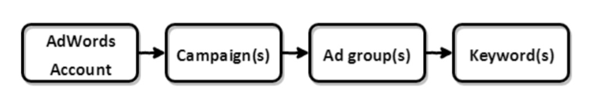

# Google-Adwords-Utilizing

Writing Python script, that will check, daily, if our Tracking URL Templates are set correctly:

  At campaign-level, it needs to alert on the account(s) and campaign(s) containing any Tracking URL Templates.

  At keyword-level, it needs to alert on the account(s) and keyword(s) that either do not contain any Tracking URL Templates or whose Tracking URL Templates have missing parameters and what the missing parameters are.
  
The output will consist of two CSV files, one containing a list of account(s) and campaign(s), and the other one containing a list of account(s) and keyword(s) along with the missing parameters. 

